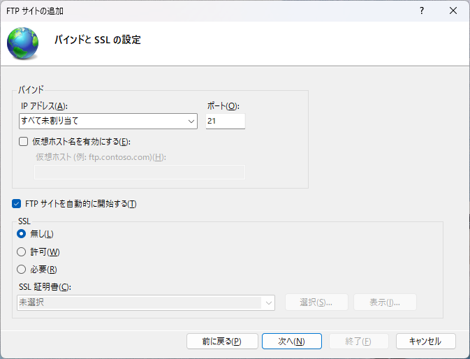

 

### Zebra-StageNow-Mirror_Create_FTP_Server on Windows 11
 

# Zebra-StageNow-Mirror向けにWindows11上でFTPサーバを構築するためのガイド

Zebra StageNowおよびMirrorの利用に際し、FTPサーバーの構築が必要となるケースがあります。本ページでは、**Windows 11 Pro**を前提としたFTPサーバー構築の要点について解説します。

なお、Windows 11以外のエディションやバージョンをご利用の場合、設定手順や挙動が異なる可能性がありますので、あらかじめご承知おきください。

また、**StageNowとMirrorではFTP通信に関する要件が異なる**ため、以下の比較表を参考に、目的に応じた適切な構成を行ってください。

---

必要に応じて、以下のような表を追加できます：

| 項目 | StageNow | Mirror |
|------|----------|--------|
| 通信方式 | パッシブ推奨 | アクティブ必須 |
| ポート要件 | 21番 + パッシブレンジ | 21番 + クライアント側ポート開放 |
| 認証方式 | ユーザー名・パスワード | 同左 |
| ファイアウォール設定 | パッシブポートの許可が必要 | クライアント側の受信ポート許可が必要 |

 

## FTPサーバ(Active)の構築

Windows 11でFTPサーバーを構築する方法は、Windows 10と同じく、標準機能の**IIS (Internet Information Services)**を利用します。手順はほぼ共通しています。

 

### ステップ1: FTPサーバー機能を有効化する

まず、FTPサーバーの役割をWindows 11に追加します。

1.  「設定」 > **「Windowsの機能の有効化～」を開く**

2.  **IISコンポーネントを有効にする**: 「Windowsの機能」ウィンドウが開いたら、以下の項目にチェックを入れます。
    * `Internet Information Services` > `FTPサーバー` > `FTPサービス`
    * `Web管理ツール` > `IIS管理コンソール`

    

3.  **再起動**: 「OK」をクリックし、機能のインストールが終わったらPCを再起動します。

 

### ステップ2: FTPサイトを作成する

IISマネージャーを使ってFTPサイトをセットアップします。

1.  **IISマネージャーを起動**: スタートボタンをクリックし、「IIS」と入力すると「Internet Information Services (IIS) マネージャー」が見つかるので、それを起動します。

2.  **新しいFTPサイトを追加**: 左側のツリーからコンピューター名を選択し、右クリックして「FTPサイトの追加」を選択します。

3.  **サイト情報の設定**:
    * **FTPサイト名**: 任意の名前（例: `ftpserver`）を入力します。
    * **物理パス**: 共有したいフォルダのパス（例: `C:\ftpserver`など）を指定します。事前にこのフォルダを作成しておいてください。

    

4.  **バインディングとSSLの設定**:
    * **IPアドレス**: ドロップダウンから`（すべて未割り当て）`を選択します。
    * **ポート**: デフォルトの `21` のままにします。
    * **SSL**: `SSLなし`を選択します。セキュリティを高める場合は`SSLを要求`を選択しますが、追加の手順が必要です。

    

5.  **認証と承認の設定**:
    * **認証**: `基本認証`にチェックを入れます。
    * **承認**: `指定されたユーザー`を選択し、FTPにアクセスさせたいWindowsユーザー名を入力します。ユーザがない場合は事前に作成しておきます。
    * **アクセス許可**: そのユーザーに「読み取り」「書き込み」の権限を付与します。

    

これらの設定後、「完了」をクリックしてFTPサイトを作成します。

***

 

### ステップ3: ファイアウォールを設定する

Windows DefenderファイアウォールでFTP通信を許可しないと、外部からアクセスできません。

1.  **「セキュリティが強化されたWindows Defender ファイアウォール」を開く**: スタートボタンをクリックし、「firewall」と入力して検索します。

2.  **受信の規則を有効にする**: 左側のメニューから「受信の規則」を選択します。

3.  **FTPルールを有効にする**: 一覧の中から「**FTPサーバー（FTP Traffic-in）**」というルールを探し、右クリックして「規則の有効化」を選択します。

  

***

 

### ステップ4: 接続テスト

FTPクライアントソフト（FileZillaなど）やWebブラウザから、作成したFTPサーバーに接続できるか確認します。

* **接続先**: `ftp://[サーバーのIPアドレス]`
* **ユーザー名**: ステップ2で設定したWindowsのユーザー名
* **パスワード**: そのユーザーのパスワード

正しく設定できていれば、FTPサーバーに接続し、共有フォルダの中身が表示されます。

 

#### セキュリティに関する注意点
**FTP**は、通信内容が暗号化されないため、ユーザー名やパスワードが盗聴されるリスクがあります。安全なファイル共有が必要な場合は、**FTPS** (FTP over SSL/TLS) や **SFTP** (SSH File Transfer Protocol) の利用を強く推奨します。

---- 
 

## FTP Passive設定

StagenowはPassiveで接続するため、ポートの追加設定が必要です。

Windows 11でFTPサーバーをパッシブモードで接続可能にするには、以下の手順を参考に設定してください。IIS（Internet Information Services）を使用した構成が一般的です。

---

 

### 🛠 IISでFTPサーバーをパッシブモードに設定する手順

 

#### 1. パッシブモードのポート範囲を設定
- IISマネージャーで「FTPファイアウォールのサポート」を開く。
- 「データチャネルポート範囲」に任意の範囲（例：60000–60050）を設定。
- 「外部IPアドレス」も必要に応じて指定（NAT環境下では特に重要）。

 

#### 4. Windowsファイアウォールの設定
- 「Windows Defender ファイアウォールの詳細設定」を開く。
- 「受信の規則」→「新しい規則」→「ポート」を選択。
- 「特定のローカルポート」に先ほど設定したポート範囲（例：60000–60005）を入力。
- 「接続を許可する」を選択し、プロファイルと名前を設定して完了。

    

 

#### 5. FTPサービスの再起動
- 「サービス」から「Microsoft FTP Service」を再起動。

#### 6. 接続確認

接続確認をします。

---

 

### ⚠ 注意点
- Windows標準の `ftp.exe` クライアントはパッシブモードに対応していないため、FFFTPやWinSCPなどの外部クライアントを使用する必要があります。
- NAT環境では、外部IPアドレスの指定が必須です。これを設定しないと、クライアントが正しいIPに接続できません。